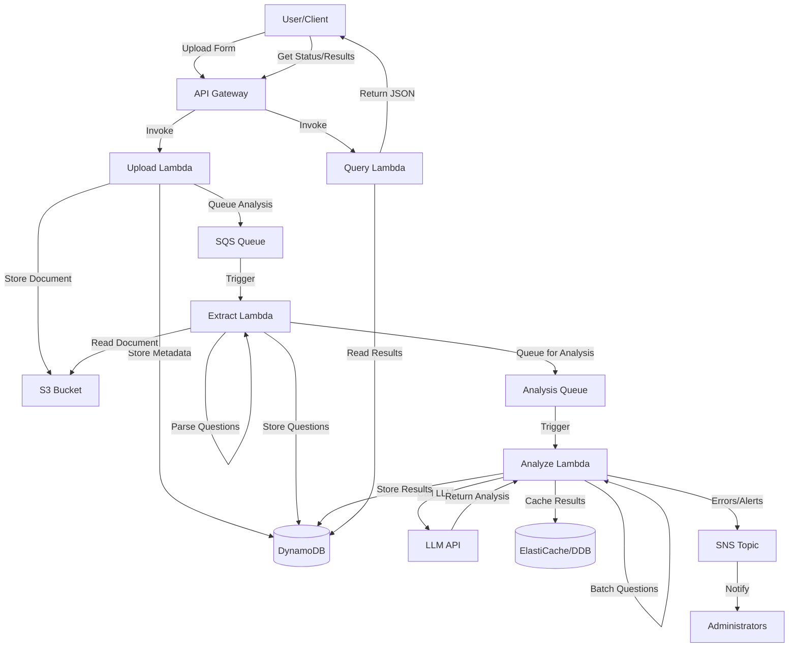

# Design Document: Government Form Ambiguity Analyzer

## Overview

The Government Form Ambiguity Analyzer is a serverless AI-powered system built on AWS that analyzes government application forms to detect and classify ambiguous questions. The system uses a large language model (LLM) to identify three types of ambiguity (linguistic, conditional, and missing-context), assigns risk levels, and generates simplified rewording suggestions.

### Key Design Principles

1. **Serverless-First Architecture**: Leverage AWS Lambda, API Gateway, S3, and DynamoDB to minimize operational overhead and enable automatic scaling
2. **Cost Optimization**: Batch LLM requests, cache results, and use appropriate storage tiers to control costs
3. **Asynchronous Processing**: Decouple form upload from analysis to handle long-running LLM operations
4. **Idempotency**: Ensure analysis operations can be safely retried without duplicate processing
5. **Extensibility**: Design for easy addition of new ambiguity types and analysis strategies

### Technology Stack

- **Compute**: AWS Lambda (Python 3.11 runtime)
- **API Layer**: AWS API Gateway (REST API)
- **Storage**: AWS S3 (document storage), DynamoDB (metadata and results)
- **Messaging**: AWS SQS (asynchronous processing queue), SNS (notifications)
- **Monitoring**: CloudWatch Logs and Metrics
- **LLM Integration**: OpenAI GPT-4 or AWS Bedrock (Claude 3)
- **Document Processing**: PyPDF2, python-docx for text extraction

## Architecture

### High-Level Architecture



### Component Architecture

The system is organized into four main processing stages:

1. **Ingestion Stage**: Handles form upload, validation, and storage
2. **Extraction Stage**: Parses documents and extracts individual questions
3. **Analysis Stage**: Detects ambiguities, classifies them, and generates rewrites
4. **Query Stage**: Provides API access to analysis results

### Data Flow

1. User uploads form via API Gateway → Upload Lambda
2. Upload Lambda stores document in S3, creates metadata record in DynamoDB, sends message to SQS
3. Extract Lambda triggered by SQS, reads document from S3, extracts questions, stores in DynamoDB
4. Extract Lambda sends each question batch to Analysis Queue
5. Analyze Lambda processes questions in batches, calls LLM API, stores results in DynamoDB
6. User queries results via API Gateway → Query Lambda → DynamoDB

## Components and Interfaces

### 1. API Gateway

**Endpoints**:

- `POST /forms` - Upload a new form for analysis
- `GET /forms/{formId}/status` - Get processing status
- `GET /forms/{formId}/results` - Get analysis results
- `DELETE /forms/{formId}` - Delete form and results

**Authentication**: API Key or IAM-based authentication

**Request/Response Formats**: JSON

### 2. Upload Lambda

**Purpose**: Handle form uploads, validate input, store documents

**Input**:
```python
{
  "fileName": str,
  "fileContent": str,  # Base64 encoded
  "fileType": str,     # "pdf", "docx", "txt"
  "metadata": {
    "agency": str,
    "formName": str,
    "version": str
  }
}
```

**Output**:
```python
{
  "formId": str,       # UUID
  "status": "uploaded",
  "message": str
}
```

**Operations**:
1. Validate file type and size (max 10MB)
2. Generate unique form ID (UUID)
3. Decode and store file in S3 at `forms/{formId}/original.{ext}`
4. Create metadata record in DynamoDB `Forms` table
5. Send message to extraction queue with form ID
6. Return form ID to user

**Error Handling**:
- Invalid file type → 400 Bad Request
- File too large → 413 Payload Too Large
- S3 write failure → 500 Internal Server Error with retry

### 3. Extract Lambda

**Purpose**: Extract text from documents and parse individual questions

**Input** (from SQS):
```python
{
  "formId": str,
  "s3Bucket": str,
  "s3Key": str,
  "fileType": str
}
```

**Operations**:
1. Read document from S3
2. Extract text based on file type:
   - PDF: Use PyPDF2 to extract text
   - DOCX: Use python-docx to extract paragraphs
   - TXT: Read directly
3. Parse questions using pattern matching and heuristics:
   - Identify question numbers (e.g., "1.", "Q1:", "Question 1")
   - Detect section headers
   - Extract help text and examples
   - Identify conditional logic keywords ("if", "skip to", "only if")
4. Store each question in DynamoDB `Questions` table
5. Batch questions (groups of 10) and send to analysis queue
6. Update form status in DynamoDB to "extracted"

**Question Parsing Strategy**:
- Use regex patterns to identify question boundaries
- Look for numbering schemes (1, 2, 3 or 1.1, 1.2, etc.)
- Identify question text vs. instructions vs. help text
- Preserve formatting and structure metadata

**Error Handling**:
- Text extraction failure → Mark form as "extraction_failed", send SNS alert
- Parsing errors → Log warnings, continue with best-effort extraction
- Empty document → Mark as "no_questions_found"

### 4. Analyze Lambda

**Purpose**: Detect ambiguities, classify them, assign risk levels, generate rewrites

**Input** (from SQS):
```python
{
  "formId": str,
  "questions": [
    {
      "questionId": str,
      "questionText": str,
      "questionNumber": str,
      "sectionHeader": str,
      "helpText": str,
      "isMandatory": bool
    }
  ]
}
```

**LLM Prompt Structure**:

```
You are an expert in government form design and plain language communication. 
Analyze the following question from a government application form for ambiguities 
that might confuse applicants, especially first-time and rural users.

Question: "{questionText}"
Context: Section "{sectionHeader}", Question #{questionNumber}
Mandatory: {isMandatory}
Help Text: "{helpText}"

Analyze this question for three types of ambiguity:

1. LINGUISTIC AMBIGUITY: Unclear wording, complex vocabulary, multiple interpretations, 
   unclear pronouns, passive voice, or jargon.

2. CONDITIONAL AMBIGUITY: Unclear skip logic, confusing dependencies on other questions, 
   ambiguous branching instructions, or unclear "if-then" conditions.

3. MISSING CONTEXT AMBIGUITY: Undefined terms, missing examples, insufficient background 
   information, or unclear scope.

For each ambiguity detected:
- Provide a confidence score (0.0 to 1.0)
- Explain the specific issue
- Assess the risk level (Low, Medium, High, Critical) considering:
  * Severity of ambiguity
  * Whether question is mandatory
  * Potential impact on form completion
- Suggest 1-3 simplified rewrites using plain language

Return your analysis in JSON format:
{
  "ambiguities": [
    {
      "type": "linguistic|conditional|missing_context",
      "confidence": float,
      "issue": str,
      "riskLevel": "low|medium|high|critical",
      "riskReasoning": str
    }
  ],
  "overallRiskLevel": "low|medium|high|critical",
  "simplifiedRewrites": [
    {
      "rewriteText": str,
      "explanation": str,
      "addressedAmbiguities": [str]
    }
  ]
}

If no ambiguities are detected, return an empty ambiguities array.
```

**Operations**:
1. Check cache (DynamoDB) for identical question text
2. If cache miss, construct LLM prompt with question details
3. Call LLM API with prompt
4. Parse JSON response from LLM
5. Validate response structure and confidence scores
6. Store analysis result in DynamoDB `AnalysisResults` table
7. Cache result keyed by question text hash
8. Update question processing status
9. When all questions for a form are complete, update form status to "completed"

**Batching Strategy**:
- Process up to 10 questions per Lambda invocation
- Use concurrent LLM API calls (max 3 concurrent) to reduce latency
- Implement circuit breaker pattern if LLM API fails repeatedly

**Caching Strategy**:
- Key: SHA-256 hash of normalized question text
- Value: Complete analysis result JSON
- TTL: 30 days
- Cache in DynamoDB `AnalysisCache` table with GSI on hash

**Error Handling**:
- LLM API timeout (>30s) → Retry with exponential backoff (3 attempts)
- LLM API rate limit → Implement token bucket algorithm, queue for later
- Invalid JSON response → Log error, mark question as "analysis_failed"
- Confidence score validation → If all scores < 0.3, flag as uncertain

### 5. Query Lambda

**Purpose**: Retrieve analysis results and processing status

**Endpoints Handled**:

**GET /forms/{formId}/status**:
```python
{
  "formId": str,
  "status": "uploaded|extracting|extracted|analyzing|completed|failed",
  "uploadedAt": str,      # ISO 8601 timestamp
  "completedAt": str,     # ISO 8601 timestamp or null
  "totalQuestions": int,
  "analyzedQuestions": int,
  "progressPercentage": float
}
```

**GET /forms/{formId}/results**:
```python
{
  "formId": str,
  "formName": str,
  "status": str,
  "summary": {
    "totalQuestions": int,
    "ambiguousQuestions": int,
    "criticalRiskCount": int,
    "highRiskCount": int,
    "mediumRiskCount": int,
    "lowRiskCount": int
  },
  "questions": [
    {
      "questionId": str,
      "questionNumber": str,
      "questionText": str,
      "sectionHeader": str,
      "ambiguities": [
        {
          "type": str,
          "confidence": float,
          "issue": str,
          "riskLevel": str,
          "riskReasoning": str
        }
      ],
      "overallRiskLevel": str,
      "simplifiedRewrites": [
        {
          "rewriteText": str,
          "explanation": str,
          "addressedAmbiguities": [str]
        }
      ]
    }
  ]
}
```

**Query Parameters**:
- `riskLevel`: Filter by risk level (low, medium, high, critical)
- `ambiguityType`: Filter by ambiguity type (linguistic, conditional, missing_context)
- `section`: Filter by section header

**Operations**:
1. Query DynamoDB `Forms` table for form metadata
2. Query DynamoDB `Questions` and `AnalysisResults` tables for question data
3. Apply filters based on query parameters
4. Aggregate summary statistics
5. Return formatted JSON response

**Error Handling**:
- Form not found → 404 Not Found
- Analysis in progress → Return partial results with status
- DynamoDB query failure → 500 Internal Server Error

### 6. DynamoDB Tables

**Forms Table**:
- Partition Key: `formId` (String)
- Attributes: `fileName`, `fileType`, `s3Key`, `status`, `uploadedAt`, `completedAt`, `totalQuestions`, `analyzedQuestions`, `metadata`
- GSI: `status-uploadedAt-index` for querying by status

**Questions Table**:
- Partition Key: `formId` (String)
- Sort Key: `questionId` (String)
- Attributes: `questionNumber`, `questionText`, `sectionHeader`, `helpText`, `isMandatory`, `extractedAt`, `analysisStatus`

**AnalysisResults Table**:
- Partition Key: `questionId` (String)
- Attributes: `formId`, `ambiguities` (List), `overallRiskLevel`, `simplifiedRewrites` (List), `analyzedAt`, `llmModel`, `llmTokensUsed`

**AnalysisCache Table**:
- Partition Key: `questionHash` (String)
- Attributes: `analysisResult` (Map), `cachedAt`, `hitCount`
- TTL: `expiresAt` (30 days from cachedAt)

### 7. S3 Bucket Structure

```
forms-bucket/
├── forms/
│   └── {formId}/
│       └── original.{ext}
└── archived/
    └── {year}/
        └── {month}/
            └── {formId}/
                └── original.{ext}
```

**Lifecycle Policies**:
- Transition to S3 Intelligent-Tiering after 30 days
- Transition to Glacier after 90 days
- Delete after 365 days (configurable)

### 8. SQS Queues

**ExtractionQueue**:
- Visibility timeout: 5 minutes
- Message retention: 4 days
- Dead letter queue: ExtractionDLQ (after 3 retries)

**AnalysisQueue**:
- Visibility timeout: 10 minutes (to accommodate LLM API calls)
- Message retention: 4 days
- Dead letter queue: AnalysisDLQ (after 3 retries)
- Batch size: 10 messages per Lambda invocation

## Data Models

### Form Entity

```python
class Form:
    form_id: str              # UUID
    file_name: str
    file_type: str            # "pdf", "docx", "txt"
    s3_bucket: str
    s3_key: str
    status: str               # "uploaded", "extracting", "extracted", 
                              # "analyzing", "completed", "failed"
    uploaded_at: datetime
    completed_at: datetime | None
    total_questions: int
    analyzed_questions: int
    metadata: dict            # agency, formName, version, etc.
```

### Question Entity

```python
class Question:
    question_id: str          # UUID
    form_id: str
    question_number: str      # "1", "1.a", "Q5", etc.
    question_text: str
    section_header: str
    help_text: str
    is_mandatory: bool
    extracted_at: datetime
    analysis_status: str      # "pending", "analyzing", "completed", "failed"
```

### Ambiguity Entity

```python
class Ambiguity:
    type: str                 # "linguistic", "conditional", "missing_context"
    confidence: float         # 0.0 to 1.0
    issue: str                # Description of the specific problem
    risk_level: str           # "low", "medium", "high", "critical"
    risk_reasoning: str       # Explanation of risk assessment
```

### SimplifiedRewrite Entity

```python
class SimplifiedRewrite:
    rewrite_text: str
    explanation: str          # What was changed and why
    addressed_ambiguities: list[str]  # Types of ambiguities addressed
```

### AnalysisResult Entity

```python
class AnalysisResult:
    question_id: str
    form_id: str
    ambiguities: list[Ambiguity]
    overall_risk_level: str   # Highest risk among all ambiguities
    simplified_rewrites: list[SimplifiedRewrite]
    analyzed_at: datetime
    llm_model: str            # "gpt-4", "claude-3-opus", etc.
    llm_tokens_used: int
```

### Risk Level Determination Logic

```python
def determine_risk_level(
    ambiguity_severity: float,  # 0.0 to 1.0 from confidence
    is_mandatory: bool,
    ambiguity_type: str
) -> str:
    """
    Determine risk level based on multiple factors.
    
    Risk Matrix:
    - Critical: Mandatory question + High severity (>0.8)
    - High: Mandatory question + Medium severity (0.6-0.8) OR
            Optional question + High severity (>0.8)
    - Medium: Mandatory question + Low severity (0.4-0.6) OR
              Optional question + Medium severity (0.6-0.8)
    - Low: Optional question + Low severity (<0.6)
    
    Conditional ambiguity increases risk by one level due to
    potential for cascading errors.
    """
    if is_mandatory and ambiguity_severity > 0.8:
        base_risk = "critical"
    elif (is_mandatory and ambiguity_severity > 0.6) or \
         (not is_mandatory and ambiguity_severity > 0.8):
        base_risk = "high"
    elif (is_mandatory and ambiguity_severity > 0.4) or \
         (not is_mandatory and ambiguity_severity > 0.6):
        base_risk = "medium"
    else:
        base_risk = "low"
    
    # Escalate conditional ambiguity by one level
    if ambiguity_type == "conditional" and base_risk != "critical":
        risk_escalation = {
            "low": "medium",
            "medium": "high",
            "high": "critical"
        }
        return risk_escalation[base_risk]
    
    return base_risk
```


## Correctness Properties

*A property is a characteristic or behavior that should hold true across all valid executions of a system—essentially, a formal statement about what the system should do. Properties serve as the bridge between human-readable specifications and machine-verifiable correctness guarantees.*

### Property 1: File Format Acceptance

*For any* uploaded file, if the file type is PDF, DOCX, or TXT, then the system should accept it; if the file type is any other format, then the system should reject it with an appropriate error.

**Validates: Requirements 1.1**

### Property 2: Upload-Retrieve Round Trip

*For any* uploaded form document, storing it in S3 and then retrieving it using the returned form ID should produce content identical to the original upload.

**Validates: Requirements 1.2**

### Property 3: Structure Preservation During Extraction

*For any* form document with identifiable structure (question numbers, sections, help text), the extracted text should maintain all structural elements present in the original.

**Validates: Requirements 1.3**

### Property 4: Extraction Error Messages

*For any* corrupted or invalid form document that fails text extraction, the system should return a non-empty error message describing the failure reason.

**Validates: Requirements 1.4**

### Property 5: Question Capacity Limit

*For any* form containing between 1 and 500 questions, the system should successfully process all questions; for forms with more than 500 questions, the system should reject the form with an appropriate error.

**Validates: Requirements 1.5**

### Property 6: Question Extraction Completeness

*For any* form with a known number of questions, the extraction process should identify and extract exactly that number of questions.

**Validates: Requirements 2.1**

### Property 7: Metadata Preservation

*For any* question with associated metadata (question number, section header, help text), the extracted question entity should contain all the original metadata fields with their values unchanged.

**Validates: Requirements 2.2**

### Property 8: Sub-Question Relationship Preservation

*For any* question with sub-questions or conditional branches, the extracted question entities should maintain parent-child relationships such that all related questions can be traversed from the parent.

**Validates: Requirements 2.3**

### Property 9: Question Format Recognition

*For any* question in fill-in-the-blank, multiple choice, or free text format, the system should correctly identify and label the question format type.

**Validates: Requirements 2.4**

### Property 10: Question Storage Round Trip

*For any* extracted question, storing it in DynamoDB and then querying by question ID should return a question entity with all fields matching the original extracted data.

**Validates: Requirements 2.5**

### Property 11: LLM Invocation for Analysis

*For any* question submitted for analysis, the system should make at least one LLM API call to evaluate the question for ambiguity.

**Validates: Requirements 3.1**

### Property 12: Valid Ambiguity Classification

*For any* detected ambiguity, the classification type should be exactly one of: "linguistic", "conditional", or "missing_context".

**Validates: Requirements 3.2**

### Property 13: Multiple Ambiguity Detection

*For any* question with multiple distinct ambiguity types, the analysis result should contain separate ambiguity entries for each type detected.

**Validates: Requirements 3.3**

### Property 14: Question Batching

*For any* set of questions sent for LLM analysis, the system should group them into batches where each batch contains at most 10 questions before making LLM API calls.

**Validates: Requirements 3.4**

### Property 15: Retry Logic on Failure

*For any* question where LLM analysis fails or times out, the system should retry the analysis up to 3 times before marking the question as "unanalyzed".

**Validates: Requirements 3.5**

### Property 16: Ambiguity Issue Description Completeness

*For any* detected ambiguity of any type (linguistic, conditional, or missing_context), the issue description field should be non-empty and contain specific details about the problem.

**Validates: Requirements 4.1, 4.2, 4.3**

### Property 17: Confidence Score Bounds

*For any* ambiguity classification, the confidence score should be a float value between 0.0 and 1.0 inclusive.

**Validates: Requirements 4.4**

### Property 18: Uncertain Classification Flagging

*For any* ambiguity with a confidence score below 0.6, the system should flag the classification as uncertain.

**Validates: Requirements 4.5**

### Property 19: Valid Risk Level Assignment

*For any* detected ambiguity, the assigned risk level should be exactly one of: "low", "medium", "high", or "critical".

**Validates: Requirements 5.1**

### Property 20: Risk Level Factor Sensitivity

*For any* ambiguous question, if the ambiguity severity increases (while keeping other factors constant), the risk level should either stay the same or increase; it should never decrease.

**Validates: Requirements 5.2**

### Property 21: Maximum Risk Aggregation

*For any* question with multiple detected ambiguities, the overall risk level assigned to the question should equal the highest risk level among all individual ambiguities.

**Validates: Requirements 5.3**

### Property 22: Critical Risk for Mandatory High-Severity

*For any* question that is mandatory and has an ambiguity with severity greater than 0.8, the system should assign a risk level of "critical".

**Validates: Requirements 5.4**

### Property 23: Low Risk for Optional Low-Severity

*For any* question that is optional and has only ambiguities with severity less than 0.6, the system should assign a risk level of "low".

**Validates: Requirements 5.5**

### Property 24: Rewrite Generation for Ambiguous Questions

*For any* question with at least one detected ambiguity, the analysis result should contain at least one simplified rewrite suggestion.

**Validates: Requirements 6.1**

### Property 25: Rewrite Count Bounds

*For any* ambiguous question, the number of simplified rewrite suggestions should be between 1 and 3 inclusive.

**Validates: Requirements 6.4**

### Property 26: Rewrite Explanation Completeness

*For any* simplified rewrite suggestion, the explanation field should be non-empty and describe what was changed.

**Validates: Requirements 6.5**

### Property 27: Analysis Results Completeness

*For any* form that has completed analysis, querying the results should return all detected ambiguities with their classifications and risk levels for every question in the form.

**Validates: Requirements 7.1**

### Property 28: Results Field Completeness

*For any* analysis result returned by the API, it should contain all required fields: original question text, detected issues (if any), and simplified rewrites (if ambiguities were found).

**Validates: Requirements 7.2**

### Property 29: Results Filtering Correctness

*For any* filter criteria (risk level, ambiguity type, or section), the returned results should contain only questions that match the specified criteria, and should not exclude any matching questions.

**Validates: Requirements 7.3**

### Property 30: JSON Format Validity

*For any* analysis result returned by the API, the response body should be valid JSON that can be parsed without errors.

**Validates: Requirements 7.4**

### Property 31: In-Progress Status Reporting

*For any* form that is currently being processed (status is not "completed" or "failed"), the status endpoint should return a valid status value and a progress percentage between 0 and 100.

**Validates: Requirements 7.5**

### Property 32: Request Throttling

*For any* sequence of requests that exceeds the configured rate limit threshold, the system should throttle subsequent requests until the rate falls below the threshold.

**Validates: Requirements 8.3**

### Property 33: Cache Hit for Identical Questions

*For any* question text, if it is analyzed twice, the second analysis should retrieve results from the cache without making a new LLM API call.

**Validates: Requirements 8.4**

### Property 34: FIFO Queue Processing

*For any* set of analysis requests submitted when system load is high, the requests should be processed in the order they were received (first-in, first-out).

**Validates: Requirements 8.5**

### Property 35: Error Logging Completeness

*For any* error that occurs during form processing, the system should create a log entry containing the form ID, question ID (if applicable), error type, and error message.

**Validates: Requirements 9.1**

### Property 36: Exponential Backoff on Rate Limits

*For any* sequence of LLM API calls that encounter rate limit errors, the delay between retry attempts should increase exponentially (e.g., 1s, 2s, 4s, 8s).

**Validates: Requirements 9.2**

### Property 37: Metrics Publication

*For any* form processing operation, the system should publish metrics to CloudWatch including at minimum: processing time, error count (if any), and LLM API token usage.

**Validates: Requirements 9.3**

### Property 38: Critical Error Notifications

*For any* error classified as critical (e.g., complete system failure, data corruption), the system should send a notification message via SNS.

**Validates: Requirements 9.4**

### Property 39: Audit Trail Completeness

*For any* form upload or analysis request, the system should create an audit record in DynamoDB containing the operation type, timestamp, form ID, and user identity.

**Validates: Requirements 9.5**

### Property 40: Unique Form ID Generation

*For any* form upload, the system should return a form ID that is unique across all forms in the system.

**Validates: Requirements 10.2**

### Property 41: Status Endpoint Response Completeness

*For any* valid form ID, the status endpoint should return a response containing the current status, progress percentage, total questions, and analyzed questions count.

**Validates: Requirements 10.3**

### Property 42: Authentication Enforcement

*For any* API request without valid authentication credentials (API key or IAM role), the system should reject the request with a 401 or 403 HTTP status code.

**Validates: Requirements 10.5**

### Property 43: S3 Encryption Verification

*For any* form document stored in S3, the object metadata should indicate that server-side encryption is enabled.

**Validates: Requirements 11.1**

### Property 44: DynamoDB Encryption Verification

*For any* analysis result stored in DynamoDB, the table configuration should have encryption at rest enabled.

**Validates: Requirements 11.2**

### Property 45: Archival to Glacier

*For any* form that is older than 90 days, the S3 object should have a storage class of "GLACIER" or "DEEP_ARCHIVE".

**Validates: Requirements 11.3**

### Property 46: Deletion Completeness

*For any* form deletion request, after the operation completes, the form document should not be retrievable from S3 and the form metadata should not be retrievable from DynamoDB.

**Validates: Requirements 11.4**

### Property 47: Form Metadata Completeness

*For any* form in the system, the metadata record should contain all required fields: upload timestamp, analysis completion time (if completed), total questions, analyzed questions, and user identity.

**Validates: Requirements 11.5**

### Property 48: S3 Lifecycle Policy Configuration

*For any* S3 bucket used for form storage, the bucket should have lifecycle policies configured to transition objects to Intelligent-Tiering after 30 days and to Glacier after 90 days.

**Validates: Requirements 12.2**

### Property 49: Cost Threshold Alerts

*For any* form analysis where the total LLM API cost exceeds the configured threshold, the system should send an alert to administrators via SNS.

**Validates: Requirements 12.5**

## Error Handling

### Error Categories

1. **Client Errors (4xx)**:
   - Invalid file format → 400 Bad Request
   - File too large → 413 Payload Too Large
   - Form not found → 404 Not Found
   - Unauthorized → 401 Unauthorized
   - Forbidden → 403 Forbidden

2. **Server Errors (5xx)**:
   - S3 write failure → 500 Internal Server Error
   - DynamoDB query failure → 500 Internal Server Error
   - LLM API timeout → 504 Gateway Timeout
   - Unexpected exceptions → 500 Internal Server Error

3. **Processing Errors**:
   - Text extraction failure → Mark form as "extraction_failed", send SNS alert
   - Question parsing errors → Log warnings, continue with best-effort
   - LLM analysis failure → Retry with exponential backoff, mark as "unanalyzed" after 3 attempts
   - Invalid LLM response → Log error, mark question as "analysis_failed"

### Retry Strategy

**Transient Errors** (network issues, timeouts, rate limits):
- Implement exponential backoff: 1s, 2s, 4s, 8s, 16s
- Maximum 3 retry attempts
- Use jitter to prevent thundering herd

**Permanent Errors** (invalid input, authentication failure):
- No retry
- Return error immediately to client

**LLM API Rate Limits**:
- Implement token bucket algorithm
- Queue requests when rate limit is reached
- Process queued requests as capacity becomes available

### Dead Letter Queues

- ExtractionDLQ: Messages that fail extraction after 3 attempts
- AnalysisDLQ: Messages that fail analysis after 3 attempts
- Manual review and reprocessing of DLQ messages
- CloudWatch alarms when DLQ depth exceeds threshold

### Circuit Breaker Pattern

For LLM API calls:
- Open circuit after 5 consecutive failures
- Half-open after 60 seconds to test recovery
- Close circuit after 3 consecutive successes
- While open, fail fast and return cached results if available

## Testing Strategy

### Dual Testing Approach

The system will be validated using both unit tests and property-based tests:

- **Unit tests**: Verify specific examples, edge cases, and error conditions
- **Property tests**: Verify universal properties across all inputs
- Both approaches are complementary and necessary for comprehensive coverage

### Unit Testing

Unit tests will focus on:

1. **Specific Examples**:
   - Upload a sample PDF form and verify it's stored correctly
   - Extract questions from a known form and verify count matches expected
   - Analyze a question with known ambiguity and verify classification

2. **Edge Cases**:
   - Empty form (0 questions)
   - Form with exactly 500 questions (boundary)
   - Form with 501 questions (over limit)
   - Corrupted PDF file
   - Question with no ambiguities
   - Question with all three ambiguity types

3. **Error Conditions**:
   - S3 bucket not accessible
   - DynamoDB table not found
   - LLM API returns 429 (rate limit)
   - LLM API returns invalid JSON
   - Authentication failure

4. **Integration Points**:
   - API Gateway → Lambda integration
   - Lambda → S3 integration
   - Lambda → DynamoDB integration
   - Lambda → SQS integration
   - Lambda → LLM API integration

### Property-Based Testing

Property tests will be implemented using **Hypothesis** (Python) and configured to run a minimum of 100 iterations per test. Each property test will be tagged with a comment referencing the design document property.

**Tag format**: `# Feature: government-form-ambiguity-analyzer, Property {number}: {property_text}`

Example property test structure:

```python
from hypothesis import given, strategies as st
import pytest

# Feature: government-form-ambiguity-analyzer, Property 2: Upload-Retrieve Round Trip
@given(
    file_content=st.binary(min_size=1, max_size=10_000_000),
    file_type=st.sampled_from(['pdf', 'docx', 'txt'])
)
def test_upload_retrieve_round_trip(file_content, file_type):
    """For any uploaded form, retrieving it should return identical content."""
    # Upload form
    form_id = upload_form(file_content, file_type)
    
    # Retrieve form
    retrieved_content = retrieve_form(form_id)
    
    # Assert content is identical
    assert retrieved_content == file_content
```

**Property Test Coverage**:

Each of the 49 correctness properties will have a corresponding property-based test. Key properties to prioritize:

1. **Round-trip properties** (Properties 2, 10): Upload/retrieve, store/query
2. **Bounds checking** (Properties 5, 17, 25): Question limits, confidence scores, rewrite counts
3. **Classification validity** (Properties 12, 19): Valid ambiguity types, valid risk levels
4. **Aggregation properties** (Property 21): Maximum risk level
5. **Filtering correctness** (Property 29): Results filtering
6. **Caching behavior** (Property 33): Cache hits for identical questions
7. **Error handling** (Properties 15, 36): Retry logic, exponential backoff

### Test Data Generation

For property-based tests, we will generate:

1. **Form documents**:
   - Random text content with question patterns
   - Varying numbers of questions (1-500)
   - Different file formats (PDF, DOCX, TXT)

2. **Questions**:
   - Random question text with varying complexity
   - Different question formats (fill-in-blank, multiple choice, free text)
   - Questions with and without metadata
   - Questions with sub-questions

3. **Ambiguities**:
   - Random confidence scores (0.0-1.0)
   - All three ambiguity types
   - Varying severity levels

4. **Edge cases**:
   - Empty strings
   - Very long strings (>10,000 characters)
   - Special characters and Unicode
   - Malformed JSON
   - Invalid file formats

### Mocking Strategy

For testing, we will mock:

1. **AWS Services**:
   - Use `moto` library to mock S3, DynamoDB, SQS, SNS
   - Use `localstack` for integration testing

2. **LLM API**:
   - Mock LLM responses with predefined analysis results
   - Simulate rate limits, timeouts, and errors
   - Use recorded real LLM responses for realistic testing

3. **Time-dependent behavior**:
   - Mock datetime for testing archival policies
   - Mock sleep/delays for testing retry logic

### Performance Testing

While not part of unit/property tests, performance testing will validate:

1. **Throughput**: Forms processed per minute under various loads
2. **Latency**: Average time from upload to completed analysis
3. **Scalability**: System behavior with 10x, 100x normal load
4. **Cost**: LLM API costs per form at different scales

### Test Environment

- **Local development**: Use mocked AWS services and LLM API
- **CI/CD pipeline**: Run all unit and property tests on every commit
- **Staging environment**: Run integration tests with real AWS services and LLM API
- **Production**: Monitor real-world behavior and compare to test predictions
